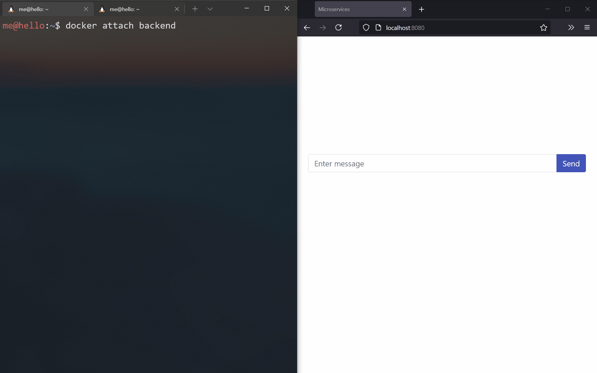

# Microservices

A basic example of microservice architecture which demonstrates communication between a few loosely coupled services.

* Written in Go
* Uses RabbitMQ to communicate between services
* Uses WebSocket to talk to the front end
* Stores data in PostgreSQL
* Stores cache in Redis
* Uses React for front end development
* Builds with Docker
* Deployed on AWS with CloudFormation templates
    * ECS using EC2 instances
    * AWS Fargate
* Uses CI/CD pipeline for continuous delivery



## Local use

To run the example, clone the Github repository and start the services using Docker Compose. Once Docker finishes downloading and building images, the front end is accessible by visiting `localhost:8080`.

```bash
git clone https://github.com/ebosas/microservices
cd microservices
```
```bash
docker-compose up
```

### Database

To inspect the database, launch a new container that will connect to our Postgres database. Then enter the password `demopsw` (see the `.env` file).

```bash
docker run -it --rm \
    --network microservices_network \
    postgres:13-alpine \
    psql -h postgres -U postgres -d microservices
```

Select everything from the messages table:

```sql
select * from messages;
```

### Redis

To inspect Redis, connect to its container via redis-cli.

```bash
docker run -it --rm \
    --network microservices_network \
    redis:6-alpine \
    redis-cli -h redis
```

Get all cached messages or show the number of messages.

```bash
lrange messages 0 -1
get total
```

### RabbitMQ

Access the RabbitMQ management interface by visiting `localhost:15672` with `guest` as both username and password.

### Back end

To access the back end service, attach to its docker container from a separate terminal window. Messages from the front end will show up here. Also, standart input will be sent to the front end for two way communication.

```bash
docker attach microservices_backend
```

## Deployment to Amazon ECS/AWS Fargate

`cd deployments` and create the CI/CD pipeline stack. Then visit the `ExternalUrl` in the load balancer's Outputs tab in CloudFormation.

```bash
aws cloudformation create-stack \
	--stack-name MicroservicesFargate \
	--template-body file://pipeline.yml \
	--parameters \
		ParameterKey=DeploymentType,ParameterValue=fargate \
		ParameterKey=EnvironmentName,ParameterValue=microservices-fargate \
		ParameterKey=GitHubRepo,ParameterValue=<github_repo_name> \
		ParameterKey=GitHubBranch,ParameterValue=<github_branch> \
		ParameterKey=GitHubToken,ParameterValue=<github_token> \
		ParameterKey=GitHubUser,ParameterValue=<github_user> \
	--capabilities CAPABILITY_NAMED_IAM
```

### Github repo setup

Fork this repo to have a copy in your Github account.

Then, on the [Github access token page](https://github.com/settings/tokens), generate a new token with the following access:

* `repo`
* `admin:repo_hook`

### Deleting stacks

When deleting the ECS cluster stack (`cluster-ecs.yml`) in CloudFormation, the auto scaling group needs to be manually deleted. You can do it from the Auto Scaling Groups section in the AWS EC2 console.

With capacity providers, container instances need to be protected from scale-in. This interferes with the automatic deletion process in CloudFormation. 

### References

Deployment is based on these templates: https://github.com/nathanpeck/ecs-cloudformation

## Local development

For development, run the RabbitMQ and Postgres containers with Docker Compose.

```bash
docker-compose -f docker-compose-dev.yml up
```

Generate static web assets for the server service by going to `web/react` and `web/bootstrap` and running:

```bash
npm run build-server
```

### React

For React development, run `npm run serve` in `web/react` and change the script tag in the server's template to the following:

```html
<script src="http://127.0.0.1:8000/index.js"></script>
```
